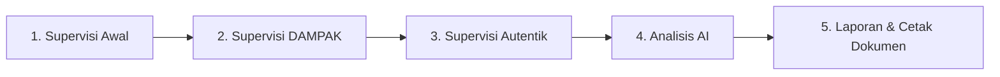

# SIMPATIK — Sistem Informasi Supervisi Dampak dan Autentik

**SIMPATIK** (*Sistem Informasi Supervisi Dampak dan Autentik*) adalah aplikasi web monolit berbasis Python Flask, SQLite, dan Jinja2 yang dirancang untuk mendokumentasikan, memantau, dan menganalisis siklus supervisi guru berkelanjutan secara terpadu, praktis, dan berbasis data autentik.

Aplikasi ini mengintegrasikan 3 tahapan siklus supervisi:
1. **Supervisi Awal (Baseline):** Pengambilan baseline kemampuan pedagogis, pengalaman belajar murid, dan refleksi guru.
2. **Supervisi DAMPAK & RTL:** Observasi berkala tindak lanjut (RTL) dengan intervensi terarah.
3. **Supervisi Autentik:** Observasi kelas autentik untuk memverifikasi konsistensi perubahan mutu pembelajaran.

---

## 🚀 Fitur Unggulan

- 📊 **Dashboard & Statistik Periode:** Pantau jumlah guru, status siklus supervisi, dan progres tahun ajaran berjalan.
- 📥 **Import File Excel Otomatis:** Unggah rekap penilaian instrumen observasi guru (hingga 40 butir indikator pembelajaran mendalam).
- 🔄 **Komparasi 3 Siklus Terpadu:** Perbandingan nilai otomatis dari Supervisi Awal ➔ DAMPAK ➔ Supervisi Autentik secara kuantitatif & kualitatif.
- 🤖 **Analisis Berbasis AI (Gemini):** Rekomendasi diferensiasi, sintesis perubahan, dan rencana tindak lanjut guru yang dipersonalisasi.
- 🖨️ **Laporan Ramah Cetak & Format Dokumen Agregat:** Format cetak standar siap ekspor PDF / Print browser sesuai kebutuhan administrasi sekolah.
- 💬 **Portal Guru & Pengiriman WhatsApp:** Guru dapat melihat perkembangan capaian mandiri dan menerima pesan notifikasi apresiasi via WhatsApp link.
- 🔐 **Multi-Peran (RBAC):** Hak akses terpisah untuk `ADMIN`, `SUPERVISOR`, dan `GURU`.

---

## 🛠️ Prasyarat Sistem

Sebelum menyalin dan menjalankan SIMPATIK, pastikan komputer/server Anda telah terpasang:
- **Python 3.9+** (Direkomendasikan Python 3.9, 3.10, atau 3.11)
- **pip** (Python package installer)
- **Git** (Opsional, untuk clone repository)
- Browser modern (Chrome, Edge, Firefox, Safari)

---

## 📥 Cara Menyalin (Clone / Copy Proyek)

### Opsi A: Menggunakan Git Clone
Buka terminal / Command Prompt, lalu jalankan:

```bash
git clone <URL_REPOSITORY_ANDA> simpatik
cd simpatik
```

### Opsi B: Menyalin Manual Folder
1. Salin seluruh isi folder proyek ini ke lokasi direktori kerja yang Anda inginkan (misalnya `/Users/.../simpatik` atau `C:\simpatik`).
2. Buka terminal lalu arahkan ke direktori tersebut:
   ```bash
   cd path/to/simpatik
   ```

---

## ⚙️ Langkah Instalasi & Pengaturan

### 1. Buat dan Aktifkan Virtual Environment

**Di macOS / Linux:**
```bash
python3 -m venv .venv
source .venv/bin/activate
```

**Di Windows (Command Prompt):**
```cmd
python -m venv .venv
.venv\Scripts\activate.bat
```

**Di Windows (PowerShell):**
```powershell
python -m venv .venv
.venv\Scripts\Activate.ps1
```

### 2. Pasang Seluruh Dependensi

Jalankan perintah berikut di dalam virtual environment:
```bash
pip install -r requirements.txt
```

### 3. Konfigurasi File Environment (`.env`)

Salin file contoh konfigurasi `.env.example` menjadi `.env`:

**macOS / Linux:**
```bash
cp .env.example .env
```

**Windows:**
```cmd
copy .env.example .env
```

Sesuaikan isi berkas `.env` bila diperlukan:
```env
SECRET_KEY=kunci-rahasia-keamanan-aplikasi-anda
DATABASE_URL=sqlite:///dampak.sqlite3
FLASK_APP=run.py
FLASK_ENV=development

# Konfigurasi AI (Opsional untuk fitur analisis AI)
AI_PROVIDER=gemini
AI_API_KEY=masukkan_api_key_gemini_anda
AI_MODEL=gemini-1.5-flash
```

---

## 🗄️ Inisialisasi Database

Jalankan perintah CLI Flask untuk membuat skema database SQLite dan akun administrator default:

```bash
flask init-db
```

*(Opsional)* Jika ingin menambahkan beberapa data pengguna contoh (Supervisor & Guru) untuk uji coba:
```bash
flask seed-sample-users
```

### Akun Bawaan (Default Credentials):
| Peran (Role) | Username | Password Default | Keterangan |
|---|---|---|---|
| **Admin** | `admin` | `admin123` | Akses penuh seluruh modul dan kelola user |
| **Supervisor** | `supervisor1` | `supervisor123` | Kelola observasi, input telaah & analisis AI |
| **Guru** | `guru1` | `guru123` | Akses hasil penilaian pribadi guru |

---

## ▶️ Menjalankan Aplikasi

Jalankan server aplikasi Flask:

```bash
python run.py
```
atau menggunakan CLI Flask:
```bash
flask run --port=5000
```

Buka peramban (browser) dan akses alamat:
👉 **`http://127.0.0.1:5000`**

---

## 📖 Alur Penggunaan SIMPATIK



1. **Masuk ke Sistem:**
   Buka halaman login dan masuk menggunakan akun `admin`.
2. **Atur Periode Supervisi:**
   Masuk ke menu Dashboard untuk memastikan Tahun Ajaran dan Semester aktif telah sesuai (misal: `2026/2027 Ganjil`).
3. **Unggah Supervisi Awal (Baseline):**
   - Masuk ke menu **Supervisi Awal**.
   - Klik **Upload Rekap Excel** dan gunakan format berkas instrumen rekap observasi (contoh berkas tersedia di akar repositori: `contoh_rekap_observasi.xlsx` atau `contoh_supervisi_direct.xlsx`).
4. **Pelaksanaan & Rekap Supervisi DAMPAK:**
   - Masuk ke menu **Supervisi DAMPAK**.
   - Unggah rekap hasil observasi siklus DAMPAK atau input data observasi lanjutan guru.
5. **Pelaksanaan Supervisi Autentik:**
   - Masuk ke menu **Supervisi Autentik**.
   - Unggah data observasi autentik untuk melihat pembuktian konsistensi peningkatan kualitas belajar murid.
6. **Analisis AI & Rekomendasi:**
   - Buka menu **Analisa** untuk melihat ringkasan agregat, sebaran indikator kritis, serta rekomendasi pembinaan otomatis berbasis AI.
7. **Laporan & Cetak Dokumen:**
   - Buka menu **Laporan** untuk melihat grafik komparasi.
   - Klik **Format Dokumen** untuk mencetak laporan agregat resmi yang rapi dan ramah printer (format A4 landscape/portrait sesuai kebutuhan).
8. **Akses Guru:**
   - Guru dapat login untuk melihat grafik perkembangan kompetensi dan membaca catatan apresiatif dari Kepala Sekolah.

---

## 🧪 Menjalankan Pengujian Otomatis (Tests)

Proyek ini telah dilengkapi dengan unit test dan integrasi pengujian (pytest):

```bash
PYTHONPATH=. pytest
```

Untuk melihat rincian pengujian:
```bash
PYTHONPATH=. pytest -v
```

---

## 📁 Struktur Direktori Proyek

```text
simpatik/
├── app/
│   ├── __init__.py           # Application Factory, CLI commands, & extensions
│   ├── auth.py               # Modul autentikasi & otorisasi peran pengguna
│   ├── extensions.py         # Inisialisasi db (SQLAlchemy) & login_manager
│   ├── models.py             # Model Database (Guru, Supervisi, Indikator, RTL, dll.)
│   ├── routes.py             # Controller utama untuk alur supervisi 3 tahapan
│   ├── static/
│   │   └── css/
│   │       └── style.css     # SIMPATIK Modern Vanilla CSS & print styles
│   └── templates/            # Template tampilan Jinja2
│       ├── base.html         # Kerangka layout & navigasi navbar SIMPATIK
│       ├── login.html        # Halaman masuk sistem
│       ├── dashboard.html    # Dashboard & statistik periode
│       ├── supervisions.html # Modul Supervisi Awal
│       ├── rtl_dampak.html   # Modul Supervisi DAMPAK
│       ├── supervisi_autentik.html # Modul Supervisi Autentik
│       ├── analysis.html     # Modul Analisa AI & rekomendasi
│       ├── reports.html      # Grafik analitik & laporan agregat
│       ├── report_agregat_doc.html # Format cetak dokumen resmi
│       └── guru_hasil.html   # Halaman hasil mandiri guru
├── instance/
│   └── dampak.sqlite3        # Database SQLite lokal
├── tests/                    # Pengujian otomatis pytest
├── .env.example              # Contoh variabel lingkungan
├── requirements.txt          # Daftar paket python
├── run.py                    # Entry point aplikasi
└── README.md                 # Dokumentasi proyek
```

---

## 📄 Lisensi & Hak Cipta

Dikembangkan untuk kebutuhan supervisi guru berkelanjutan di satuan pendidikan.  
&copy; 2026 **SIMPATIK** — *Sistem Informasi Supervisi Dampak dan Autentik*.
